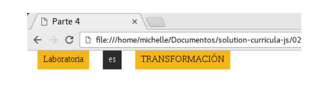

# Banderas Display - cuarto ejercicio

## Descripción

Se pide replicar el siguiente modelo:

A tener en cuenta:

* Se debe hacer uso de la propiedad display y no de las propiedades position o float.

* Ser lo más preciso posible con los detalles.

Links consultados:

[Enlace 1][1], [Enlace 2][2], [Enlace 3][3]

 [1]: https://www.w3.org/TR/html/index.html#contents
 [2]: https://developer.mozilla.org/es/docs/Web/CSS/display
 [3]: https://developer.mozilla.org/es/docs/Web/CSS/float